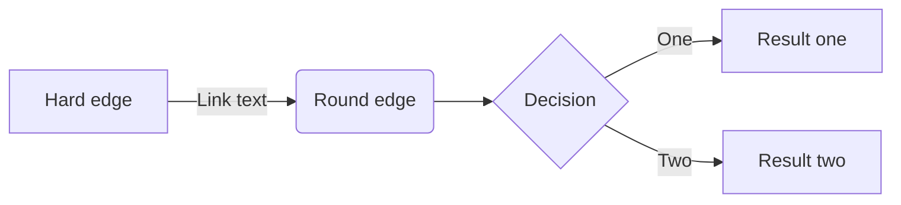
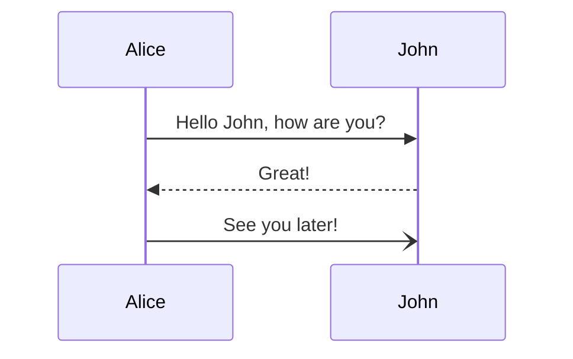
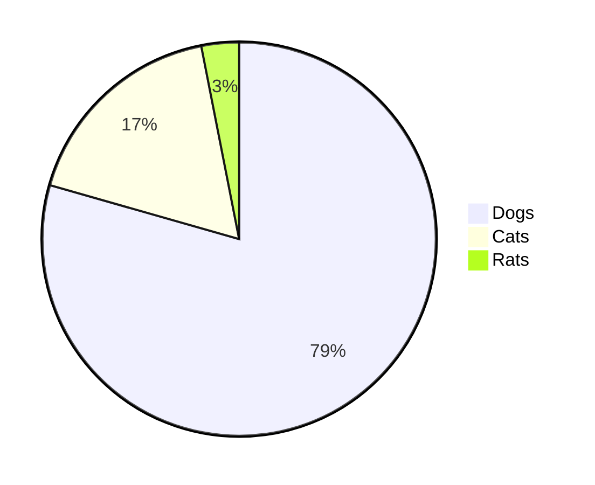

:::message alert
このページは、 Cardano Staking Pool のサイトを公開できる **SPO Pages 内で使用できる Markdown 記法**をまとめたものです。
:::

# 見出し

```
# 見出し1
## 見出し2
### 見出し3
#### 見出し4
```

# 見出し1
## 見出し2
### 見出し3
#### 見出し4

***

# リスト

```
- Hello!
- Hola!
  - Bonjour!
  * Hi!
```

- Hello!
- Hola!
  - Bonjour!
  * Hi!

## 番号付きリスト

```
1. First
2. Second
```

1. First
2. Second

***

# リンク
## テキストリンク

```
[アンカーテキスト](リンクのURL)
```

[アンカーテキスト](https://docs-449sabu.vercel.app/)

## リンクカード

```
https://zenn.dev/zenn/articles/markdown-guide
```

https://zenn.dev/zenn/articles/markdown-guide

***


# テーブル

```
| Head | Head | Head |
| ---- | ---- | ---- |
| Text | Text | Text |
| Text | Text | Text |
```

| Head | Head | Head |
| ---- | ---- | ---- |
| Text | Text | Text |
| Text | Text | Text |

***

# コードブロック
- シンタックスハイライトには[Rehype Pretty Code](https://rehype-pretty-code.netlify.app/)を使用しています。

~~~
# 記述方法

```js
const Hello = () => {
  console.log("Hello World !");
};
```
~~~

```js
const Hello = () => {
  console.log("Hello World !");
};
```

- ファイル名を表示したい場合は言語(例: js)の後に**半角スペースを一つ開けて**コロン(:) + ファイル名
~~~
# 記述方法
```js :./hello.js
const Hello = () => {
  console.log("Hello World !");
};
```
~~~

```js :./hello.js
const Hello = () => {
  console.log("Hello World !");
};
```

***

# ダイアグラム
- [mermaid.js](https://mermaid-js.github.io/mermaid/#/) を使用してダイアグラムを作成できます。
- コードブロックの言語名を`mermaid`とすることで自動的にレンダリングされます。
- 文法は[公式サイト](https://mermaid-js.github.io/mermaid/#/flowchart)をご確認ください。

~~~

~~~






***

# 画像の挿入

```

```


***

# GFM 記法
- GFM(GitHub Flavored Markdown)記法とは、 Github が採用している独自記法のことで README.md や Issue 等で主に使用されています。
SPO Pages で作成するブログは、GFM記法を一部サポートしています。
- 詳しくは、[GitHub Flavored Markdown 記法](https://github.github.com/gfm/)をご参照ください。

## タスクリスト(Tasklist)

```
* [ ] to do
* [x] done
```

* [ ] to do
* [x] done

## 脚注（Footnotes）
- 脚注の説明文はページ下部にレンダリングされます。
内部リンクを通して脚注を往復できます。

```
Footnote 1 link[^first].
Footnote 2 link[^second].

[^first]: Footnote **can have markup** and multiple paragraphs.
[^second]: Footnote text.
```
Footnote 1 link[^first].
Footnote 2 link[^second].

[^first]: Footnote **can have markup** and multiple paragraphs.
[^second]: Footnote text.

## 引用(Blockquotes)

```
> Blockquotes can also be nested...
>> ...by using additional greater-than signs right next to each other...
>>> ...or with spaces between arrows.
```

> Blockquotes can also be nested...
>> ...by using additional greater-than signs right next to each other...
>>> ...or with spaces between arrows.

## 取り消し戦(Strikethrough)

```
Hello ~~Hey~~ World !
```

Hello ~~Hey~~ World !


***

# Zenn 独自の記法
 - SPO Pagesの markdown ブログでは、数ある Markdown記法の中から
 - 詳しくは、[zennの記法](https://github.com/zenn-dev/zenn-docs/blob/main/articles/markdown-guide.md?plain=1)をご参照ください。

## メッセージ

```
:::message
メッセージをここに
:::
```

:::message
メッセージをここに
:::

```
:::message alert
警告メッセージをここに
:::
```

:::message alert
警告メッセージをここに
:::

***

## アコーディオントグル

```md
:::details タイトル
表示したい内容
:::
```

:::details タイトル
表示したい内容
:::

## 要素をネストさせる(非対応)

外側の要素の開始/終了に `:` を追加します。

```md
::::details 要素をネストさせる
:::message
ネストされた要素
:::
::::
```

::::details 要素をネストさせる
:::message
ネストされた要素
:::
::::

***