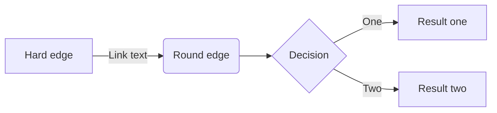
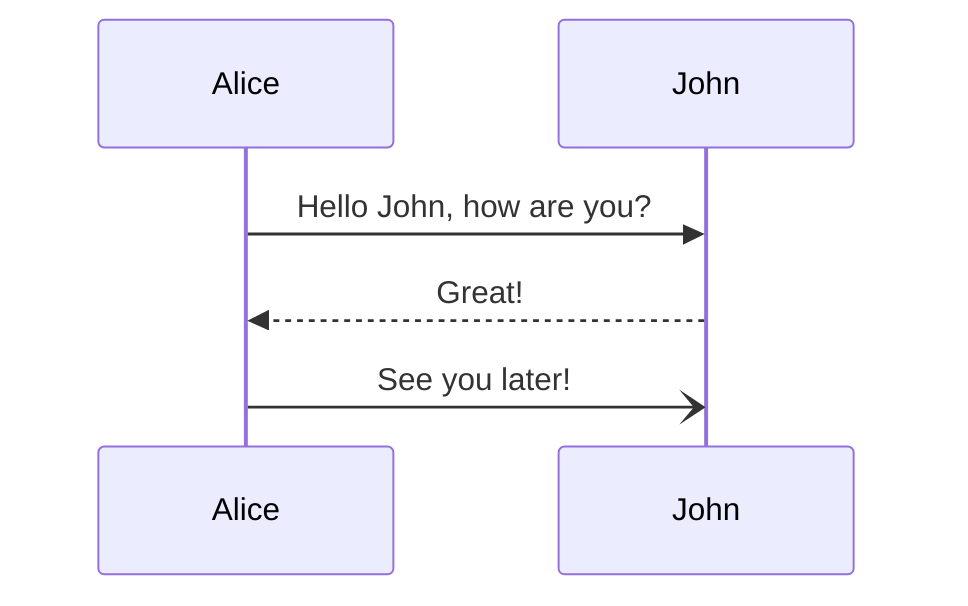
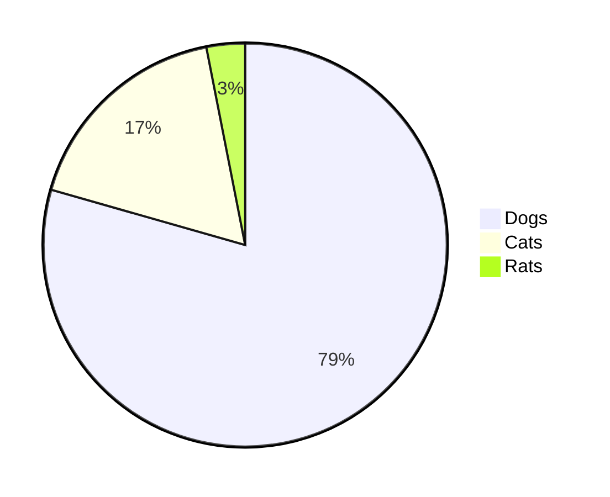

[zennの記法](https://github.com/zenn-dev/zenn-docs/blob/main/articles/markdown-guide.md?plain=1)
[gfm記法](https://markdown-it.github.io/)
# 見出し

```md
# 見出し1
## 見出し2
### 見出し3
#### 見出し4
```

# 見出し1
## 見出し2
### 見出し3
#### 見出し4

***

# リスト

```
- Hello!
- Hola!
  - Bonjour!
  * Hi!
```

- Hello!
- Hola!
  - Bonjour!
  * Hi!

## 番号付きリスト

```md
1. First
2. Second
```

1. First
2. Second

***

# テキストリンク

```md
[アンカーテキスト](リンクのURL)
```

[アンカーテキスト](https://docs-449sabu.vercel.app/)

***


# テーブル

```
| Head | Head | Head |
| ---- | ---- | ---- |
| Text | Text | Text |
| Text | Text | Text |
```

| Head | Head | Head |
| ---- | ---- | ---- |
| Text | Text | Text |
| Text | Text | Text |

***

# コードブロック
- シンタックスハイライトには[rehypeHighlight](https://github.com/rehypejs/rehype-highlight)を使用しています。

~~~
# 記述方法

```js
const Hello = () => {
  console.log("Hello World !");
};
```
~~~

```js
const Hello = () => {
  console.log("Hello World !");
};
```

***

# ダイアグラム
- [mermaid.js](https://mermaid-js.github.io/mermaid/#/) を使用してダイアグラムを作成できます。
- コードブロックの言語名を`mermaid`とすることで自動的にレンダリングされます。
- 文法は[公式サイト](https://mermaid-js.github.io/mermaid/#/flowchart)をご確認ください。

~~~

~~~






***

# メッセージ

```
:::message
メッセージをここに
:::
```

:::message
メッセージをここに
:::

```
:::message alert
警告メッセージをここに
:::
```

:::message alert
警告メッセージをここに
:::

***

# アコーディオントグル

```md
:::details タイトル
表示したい内容
:::
```

:::details タイトル
表示したい内容
:::

## 要素をネストさせる(非対応)

外側の要素の開始/終了に `:` を追加します。

```md
::::details 要素をネストさせる
:::message
ネストされた要素
:::
::::
```

::::details 要素をネストさせる
:::message
ネストされた要素
:::
::::

***

# リンクカード(非対応)
```
https://zenn.dev/zenn/articles/markdown-guide
```

https://zenn.dev/zenn/articles/markdown-guide

***

# 画像の挿入

```md

```


***